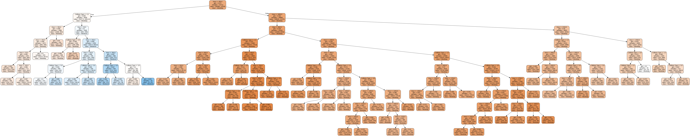

# Crash Prediction Model 1

This is a machine learning model to classify whether a traffic accident occurred on a **weekday** or a **weekend**, based on:

- The time of the accident
- The number of vehicles involved

## 🚀 Goal

The objective is to explore the relationship between the temporal characteristics and the number of vehicles to determine the type of day of the accident.

## 🧠 Model

The model was trained with a dataset of car crashes (about 53944 crashes)

Model inputs:
- `incident_time`: time of the crash (in 24h format, e.g. `14:30`)
- `vehicles_involved`: number of vehicles involved

Outputs:
- `weekday` or `weekend`

## 📊 Dataset

https://www.kaggle.com/datasets/jacksondivakarr/car-crash-dataset

## 🌳📈 Model decision flow

